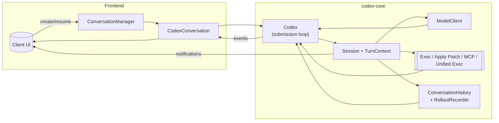
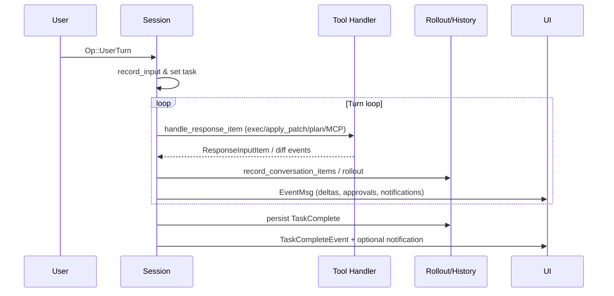

# codex-core deep dive

The `codex-core` crate powers the agent runtime that front-ends (CLI, TUI, editors)
wrap around. It owns the lifecycle of each conversation, streams model output,
mediates tool calls (exec, apply patch, MCP, notifications), enforces sandboxing,
and persists transcripts so sessions can be resumed. This guide documents the core
modules, how they collaborate, and what to consider when extending the crate.

## 1. Architecture overview
- `ConversationManager` exposes high-level APIs to create, resume, fork, and fetch
  live conversations. It wraps `Codex::spawn`, retains each `CodexConversation`
  behind an `Arc`, and ensures the first streamed event is always the initial
  `SessionConfigured` payload.【F:codex-rs/core/src/conversation_manager.rs†L23-L159】
- `Codex` encapsulates a session’s submission queue (`Sender<Submission>`) and
  event stream (`Receiver<Event>`). It generates submission ids, forwards ops into
  the submission loop, and surfaces events as they arrive.【F:codex-rs/core/src/codex.rs†L103-L199】
- A `Session` bundles state shared across turns: approval queues, pending user
  inputs, conversation history, rollout recorder, MCP connection manager, exec
  session managers, and notification hooks. `TurnContext` stores the mutable
  per-turn client configuration (model, sandbox, tools, cwd).【F:codex-rs/core/src/codex.rs†L365-L503】【F:codex-rs/core/src/codex.rs†L720-L760】
- `ModelClient` hides protocol differences between OpenAI Responses and Chat
  Completions APIs, handling retries, streaming aggregation, and reasoning
  options based on provider metadata.【F:codex-rs/core/src/client.rs†L68-L155】
- Persistence layers combine in-memory `ConversationHistory`, append-only
  rollouts (`RolloutRecorder`), and global history JSONL files so transcripts can
  be resumed, compacted, or audited later.【F:codex-rs/core/src/codex.rs†L679-L744】【F:codex-rs/core/src/rollout/recorder.rs†L52-L200】【F:codex-rs/core/src/message_history.rs†L1-L180】

## 2. Session bootstrap and conversation lifecycle
- `Codex::spawn` wires the submission/event channels, resolves user instructions,
  constructs `Session::new`, and launches the async submission loop. Errors during
  setup (MCP startup, rollout init) are surfaced after the initial event to keep
  front-ends informed.【F:codex-rs/core/src/codex.rs†L200-L236】【F:codex-rs/core/src/codex.rs†L404-L527】
- `Session::new` initializes rollout recording, discovers default shells, builds
  the model client, records initial context (user instructions + environment),
  and dispatches `SessionConfigured` followed by any deferred error events.【F:codex-rs/core/src/codex.rs†L404-L526】
- Resuming or forking conversation history replays recorded items through
  `Session::record_initial_history` so the in-memory transcript and persisted
  rollout stay in sync. Forks re-use rollout metadata for replay while trimming
  user messages as requested.【F:codex-rs/core/src/codex.rs†L555-L583】【F:codex-rs/core/src/conversation_manager.rs†L137-L195】
- Each `CodexConversation` simply forwards ops/events to the underlying `Codex`,
  making it safe to share across UI tasks that need to submit commands or read
  streamed responses.【F:codex-rs/core/src/codex_conversation.rs†L7-L30】

## 3. Submission loop and task scheduling
- The submission loop listens for `Submission` messages and reacts to each
  protocol `Op`. It handles interrupt signals, context overrides, queued user
  input, approvals, history lookups, rollout export, review requests, compaction,
  and graceful shutdown.【F:codex-rs/core/src/codex.rs†L1174-L1534】
- `AgentTask` represents a running turn, storing its abort handle so interrupts
  or replacements can terminate work and emit `TurnAborted` events. Specialised
  constructors create regular, review, or compaction tasks as needed.【F:codex-rs/core/src/codex.rs†L1082-L1172】
- User submissions first try to inject into an active task (`Session::inject_input`).
  If none is running, the loop spawns a fresh `AgentTask` against the current (or
  per-turn overridden) `TurnContext`. Environment changes are recorded into the
  transcript when overrides differ from the previous context.【F:codex-rs/core/src/codex.rs†L974-L1355】

## 4. Turn execution pipeline
- `run_task` sends `TaskStarted`, records the initial user input in history or a
  review-local buffer, and loops `run_turn` until the model finishes, errors, or
  produces no further tool calls. It tracks pending user injections, manages
  automatic compaction, and emits completion or abort events.【F:codex-rs/core/src/codex.rs†L1617-L1917】
- `run_turn` prepares the `Prompt` (history + extra items + tools), retries on
  recoverable stream failures using provider-specific budgets, and surfaces retry
  diagnostics as `StreamError` events.【F:codex-rs/core/src/codex.rs†L1944-L2001】
- `try_run_turn` streams events from the model, converting each item into
  `ProcessedResponseItem`. It persists turn context metadata, sends token usage
  updates, emits deltas (messages, reasoning, web search), and flushes unified
  diffs captured by `TurnDiffTracker`.【F:codex-rs/core/src/codex.rs†L2020-L2167】【F:codex-rs/core/src/codex.rs†L2168-L2207】
- `handle_response_item` orchestrates side effects: dispatching tool events,
  streaming deltas, invoking `handle_function_call`, and feeding MCP/local shell
  actions through the appropriate handlers.【F:codex-rs/core/src/codex.rs†L2211-L2333】
- Final turn aggregation records assistant/tool outputs back into history,
  triggers notifications, and optionally exits review mode with structured review
  results parsed from the last assistant message.【F:codex-rs/core/src/codex.rs†L1724-L1915】

## 5. Tool integrations
- Exec tool calls funnel through `handle_container_exec_with_params`, which uses
  `Session::run_exec_with_events` to emit begin/end events, stream stdout deltas,
  and compute apply-patch diffs via `TurnDiffTracker`. Sandbox selection is driven
  by `SafetyCheck` results and platform support.【F:codex-rs/core/src/codex.rs†L794-L947】【F:codex-rs/core/src/exec.rs†L47-L183】【F:codex-rs/core/src/turn_diff_tracker.rs†L25-L128】
- `apply_patch::apply_patch` evaluates patch safety, optionally asks for user
  approval, and either responds inline or delegates to exec with sandbox controls
  before emitting diff events.【F:codex-rs/core/src/apply_patch.rs†L14-L100】
- `plan_tool::handle_update_plan` validates JSON arguments, emits `PlanUpdate`
  events for UIs to render plan steps, and responds with a success payload.【F:codex-rs/core/src/plan_tool.rs†L21-L90】
- MCP tools are managed by `McpConnectionManager`, which spawns clients, tracks
  tool inventories with qualified names, exposes aggregated tool listings, and
  supports per-tool RPC invocations with timeouts.【F:codex-rs/core/src/mcp_connection_manager.rs†L1-L200】
- The experimental `unified_exec` manager maintains persistent PTY sessions for
  the unified exec tool, appending streamed output to bounded buffers and
  returning session ids so the model can continue interactive shells.【F:codex-rs/core/src/unified_exec/mod.rs†L1-L155】
- Classic exec sessions are handled by `exec_command::SessionManager`, which runs
  commands under PTYs, truncates output to configured caps, and exposes write-stdin
  continuations with session tracking.【F:codex-rs/core/src/exec_command/session_manager.rs†L26-L200】
- `openai_tools` assembles the tool list per turn based on model family,
  approval/sandbox policies, and feature toggles (plan tool, apply patch variant,
  web search, unified exec, image viewer).【F:codex-rs/core/src/openai_tools.rs†L67-L134】
- `tool_apply_patch` defines both freeform grammar and JSON function variants so
  tool selection can adapt to provider capabilities.【F:codex-rs/core/src/tool_apply_patch.rs†L11-L127】

## 6. Safety, approvals, and sandboxing
- `Session::request_command_approval` and `Session::request_patch_approval` cache
  pending approval channels, emit approval request events with command context,
  and await reviewer responses before proceeding.【F:codex-rs/core/src/codex.rs†L595-L657】
- `safety::assess_command_safety` and `assess_patch_safety` inspect the approval
  policy, sandbox configuration, known-safe command list, and writable roots to
  decide between auto-approval (with sandbox type), prompting the user, or
  rejecting the action outright.【F:codex-rs/core/src/safety.rs†L15-L167】
- Sandbox enforcement occurs in `exec::process_exec_tool_call`, which delegates
  to macOS Seatbelt, Linux landlock wrappers, or unsandboxed execution, truncating
  output and mapping signals/timeouts to structured errors.【F:codex-rs/core/src/exec.rs†L75-L183】
- `spawn::spawn_child_async` centralises process spawning, enforcing environment
  cleanup, sandbox env vars, and kill-on-drop semantics so orphaned children are
  terminated when Codex exits.【F:codex-rs/core/src/spawn.rs†L31-L106】

## 7. Configuration and runtime context
- `Config` merges disk profiles, provider defaults, and overrides to capture
  model choices, sandbox policies, notification preferences, tool toggles, MCP
  servers, Codex home directory, and active profile metadata.【F:codex-rs/core/src/config.rs†L51-L197】
- `TurnContext` snapshots the effective model client, tools config, sandbox,
  reasoning settings, and cwd for each turn, providing helpers like
  `resolve_path` and tool discovery parameters.【F:codex-rs/core/src/codex.rs†L320-L364】【F:codex-rs/core/src/codex.rs†L470-L505】
- `EnvironmentContext::new` serialises cwd, approval policy, sandbox mode,
  network access, writable roots, and shell name into tagged XML recorded as user
  messages so the model retains operating context.【F:codex-rs/core/src/environment_context.rs†L24-L160】
- `UserInstructions` wraps instructions (system prompts + project docs) in a
  tagged block that is inserted into the conversation history when a session
  starts.【F:codex-rs/core/src/user_instructions.rs†L12-L40】
- `project_doc::get_user_instructions` locates `AGENTS.md` files between the Git
  root and cwd, concatenates them (respecting byte budgets), and merges with
  configured instructions for each session.【F:codex-rs/core/src/project_doc.rs†L1-L102】

## 8. Model providers, auth, and clients
- `ModelClient::stream` chooses between Responses and Chat APIs, aggregates chat
  delta streams, attaches tool definitions, and honours provider reasoning and
  verbosity capabilities.【F:codex-rs/core/src/client.rs†L113-L195】
- `ModelProviderInfo` encapsulates provider metadata (base URLs, auth env vars,
  headers, retry/timeout budgets, wire API) and builds authenticated request
  builders, including Azure-specific behaviours.【F:codex-rs/core/src/model_provider_info.rs†L1-L200】
- `AuthManager`/`CodexAuth` load tokens from `auth.json`, refresh access tokens,
  and support both API key and ChatGPT OAuth modes, exposing account/plan data to
  feature gates.【F:codex-rs/core/src/auth.rs†L25-L187】
- `token_data` parses JWT payloads, tracks plan tiers, and serialises/deserialises
  token bundles stored on disk.【F:codex-rs/core/src/token_data.rs†L1-L118】

## 9. Transcript history, rollouts, and diffs
- `ConversationHistory` keeps an in-memory transcript of API-visible messages,
  filtering out system/internal items and supporting replace operations during
  compaction or resume.【F:codex-rs/core/src/conversation_history.rs†L1-L118】
- `Session::record_conversation_items` mirrors new items into the rollout recorder
  so the JSONL log stays append-only and resumable. User inputs additionally write
  to the global history file via `message_history::append_entry` when configured.【F:codex-rs/core/src/codex.rs†L679-L793】【F:codex-rs/core/src/message_history.rs†L58-L139】
- `RolloutRecorder` writes filtered rollout items asynchronously, exposes flush
  and shutdown hooks, and can resume existing logs while capturing session meta
  (cwd, timestamp, CLI version).【F:codex-rs/core/src/rollout/recorder.rs†L52-L200】
- `TurnDiffTracker` captures baseline file snapshots before patches, tracks
  renames, computes unified diffs, and normalises paths relative to Git roots to
  produce concise change summaries.【F:codex-rs/core/src/turn_diff_tracker.rs†L25-L199】

## 10. Custom prompts, docs, and plan surfaces
- `custom_prompts` discovers Markdown prompts under `$CODEX_HOME/prompts`, filters
  non-MD entries, excludes opt-out names, and returns sorted prompt metadata for
  slash commands or UIs.【F:codex-rs/core/src/custom_prompts.rs†L1-L126】
- `openai_tools::ToolsConfig` toggles plan/apply-patch/web-search/unified-exec
  features per model family, including streamable shell variants required for
  Responses API compatibility.【F:codex-rs/core/src/openai_tools.rs†L67-L134】
- `plan_tool` exports shared types (`PlanItemArg`, `StepStatus`, `UpdatePlanArgs`)
  so both core and protocol crates agree on plan schemas, ensuring UI rendering
  remains consistent across transports.【F:codex-rs/core/src/plan_tool.rs†L13-L90】

## 11. Notifications, approvals, and background signals
- `Session::notify_background_event` and `notify_stream_error` emit lightweight
  status messages so front-ends can show progress while tools run or retries
  occur.【F:codex-rs/core/src/codex.rs†L951-L971】
- `UserNotification::AgentTurnComplete` serialises turn summaries (input prompts
  and last assistant message) which `Session::maybe_notify` forwards to external
  notifier commands configured in `Config`. Failures are logged but do not block
  the main flow.【F:codex-rs/core/src/user_notification.rs†L1-L38】【F:codex-rs/core/src/codex.rs†L1002-L1051】
- Token usage snapshots are refreshed at the end of each streamed response and
  cached on `Session` so subsequent status requests reuse the latest totals.【F:codex-rs/core/src/codex.rs†L756-L769】【F:codex-rs/core/src/codex.rs†L2144-L2163】

## Mermaid diagrams

## Related reading
- [Custom prompts and instructions](custom_prompts.md)
- [TUI ↔ core integration guide](tui-core-interactions.md)
- [Terminal request flow](terminal_request_flow.md)
