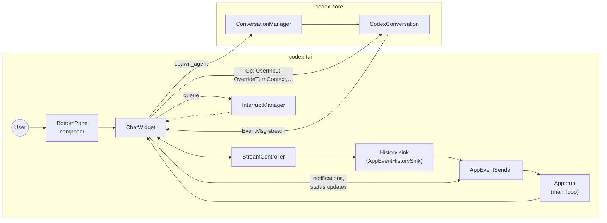

# Conversation widget deep dive

The TUI conversation widget is implemented by `ChatWidget` in `codex-tui`. It owns the
interactive chat transcript, routes user input into the agent runtime, and renders all
streamed conversation output. This guide documents how the widget is constructed, how it
reacts to core events, and how it collaborates with neighbouring subsystems such as
history cells, approvals, and the bottom composer.

## 1. Construction and bootstrap
- `ChatWidgetInit` bundles the configuration, frame scheduler, initial prompt/images, and
  authentication handle needed by every constructor. The struct keeps ownership of the
  runtime `Config` so the widget can apply per-session overrides.【F:codex-rs/tui/src/chatwidget.rs†L102-L143】
- `ChatWidget::new` creates the bottom pane, seeds a random placeholder prompt, and calls
  `spawn_agent` to start the async loops that forward `Op`s and stream `Event`s from
  `codex-core`. The helper always records outbound ops for session replay fidelity before
  sending them down the channel.【F:codex-rs/tui/src/chatwidget.rs†L656-L744】【F:codex-rs/tui/src/chatwidget.rs†L1429-L1467】
- When resuming or forking a conversation, `ChatWidget::new_from_existing` reuses an
  existing `CodexConversation`, sends the captured `SessionConfiguredEvent`, and suppresses
  the first redraw to avoid flicker. Both constructors delegate to
  `spawn_agent[_from_existing]`, which wire two Tokio tasks: one that submits UI ops and
  another that streams core events into the app inbox.【F:codex-rs/tui/src/chatwidget.rs†L745-L804】【F:codex-rs/tui/src/chatwidget/agent.rs†L16-L99】

## 2. Core state and responsibilities
- The widget aggregates conversation state: the transcript history sink, the bottom pane
  composer, queued user messages, currently running commands, token usage, and per-turn
  reasoning buffers. This enables it to drive both the visual transcript and the task
  lifecycle without asking other components for bookkeeping.【F:codex-rs/tui/src/chatwidget.rs†L113-L144】
- `StreamController` owns the animated rendering pipeline for streamed answers and feeds
  the transcript via `AppEventHistorySink`. `InterruptManager` holds exec/tool events that
  must be deferred until the active write cycle completes.【F:codex-rs/tui/src/chatwidget.rs†L123-L128】【F:codex-rs/tui/src/chatwidget.rs†L441-L490】【F:codex-rs/tui/src/chatwidget/interrupts.rs†L13-L88】
- `SessionHeader` maintains the model label shown in the UI banner, while
  `AuthManager` allows the widget to scope available model presets to the user’s auth
  mode.【F:codex-rs/tui/src/chatwidget.rs†L118-L123】【F:codex-rs/tui/src/chatwidget.rs†L1229-L1262】

## 3. Event pipeline from codex-core
- Live events arrive through `handle_codex_event`, which forwards each `EventMsg` to
  `dispatch_event_msg`. Replay mode (when resuming a rollout) passes `None` ids so that
  downstream handlers can skip side effects such as approvals.【F:codex-rs/tui/src/chatwidget.rs†L1049-L1139】
- `on_session_configured` updates conversation metadata, replays the initial transcript if
  present, and optionally injects the initial user prompt captured during construction.
  It immediately requests the list of custom prompts so the slash popup can populate.【F:codex-rs/tui/src/chatwidget.rs†L174-L198】
- Text deltas, final messages, and commit ticks flow through the `StreamController`. The
  widget flushes any active exec cell before streaming answer text, and finalizes the
  stream on commit ticks to unblock deferred interrupts.【F:codex-rs/tui/src/chatwidget.rs†L441-L492】
- Task lifecycle events (start, complete, error, turn aborted) toggle the bottom pane’s
  running state, clear reasoning buffers, and optionally queue notifications or try the
  next pending user input.【F:codex-rs/tui/src/chatwidget.rs†L249-L307】

## 4. Reasoning capture and transcript recording
- Reasoning deltas append into `reasoning_buffer`. The helper extracts the first bold
  header (`**...**`) to update the shimmering status bar while the model thinks, but does
  not stream the raw text into history until a final reasoning chunk arrives.【F:codex-rs/tui/src/chatwidget.rs†L210-L238】
- When the reasoning block ends, the accumulated summary is inserted as a dedicated
  `HistoryCell`, keeping verbose raw content in the transcript-only buffer. Section breaks
  translate into extra blank lines so the rendered Markdown remains readable.【F:codex-rs/tui/src/chatwidget.rs†L225-L245】
- Stream errors, plan tool updates, token usage updates, and background events are also
  captured in history through specialised helpers so the transcript faithfully reflects
  everything the agent did.【F:codex-rs/tui/src/chatwidget.rs†L278-L289】【F:codex-rs/tui/src/chatwidget.rs†L430-L438】【F:codex-rs/tui/src/chatwidget.rs†L308-L320】【F:codex-rs/tui/src/chatwidget.rs†L986-L1033】

## 5. Deferred interrupts, exec output, and tool calls
- `InterruptManager` queues approvals, exec commands, MCP calls, and patch completions when
  answer streaming is in progress to preserve the natural event order (e.g. exec begin
  before exec end). `defer_or_handle` centralises the logic: if a write cycle is active or
  anything is already queued, the event is enqueued; otherwise it is handled immediately.【F:codex-rs/tui/src/chatwidget.rs†L450-L513】【F:codex-rs/tui/src/chatwidget/interrupts.rs†L24-L88】
- Exec start/end events aggregate into an `ExecCell`, which groups multiple commands under
  a single transcript block and renders exit information once the command finishes.
  Failed execs are turned into ✗ blocks when a turn aborts.【F:codex-rs/tui/src/chatwidget.rs†L580-L614】【F:codex-rs/tui/src/chatwidget.rs†L494-L520】【F:codex-rs/tui/src/chatwidget.rs†L284-L293】
- Apply-patch approvals stream proposed changes, push an approval request into the bottom
  pane, and raise a desktop notification summarising the affected files. Successful patch
  completions leave the “Edited” block in place, while failures append a transcript error
  cell.【F:codex-rs/tui/src/chatwidget.rs†L552-L578】【F:codex-rs/tui/src/chatwidget.rs†L520-L538】
- MCP tool calls flush answer content, render an “active tool” block, and replace it with a
  completed summary including duration and success/failure metadata when the call ends.【F:codex-rs/tui/src/chatwidget.rs†L617-L633】

## 6. Composer, user input, and queuing
- Keyboard input is first offered to the bottom pane. Submitted text/images are converted
  into `Op::UserInput` plus an `AddToHistory` op; when a task is already running they are
  queued so the next turn starts automatically after completion.【F:codex-rs/tui/src/chatwidget.rs†L800-L833】【F:codex-rs/tui/src/chatwidget.rs†L998-L1033】【F:codex-rs/tui/src/chatwidget.rs†L1183-L1199】
- Users can recall queued prompts with `Alt+Up`, paste local images (Ctrl+V) which are saved
  as temp PNGs, and inject literal text at the cursor via helper methods used by slash
  commands.【F:codex-rs/tui/src/chatwidget.rs†L790-L851】【F:codex-rs/tui/src/chatwidget.rs†L907-L918】
- `/diff`, `/status`, `/mcp`, and other slash commands are dispatched through
  `dispatch_command`, which enforces availability during tasks and schedules async work
  before delivering results back into history or popups.【F:codex-rs/tui/src/chatwidget.rs†L853-L954】
- Paste bursts are coalesced so large clipboard payloads don’t trigger redundant renders.
  The widget schedules delayed frames until the burst is flushed.【F:codex-rs/tui/src/chatwidget.rs†L957-L977】

## 7. Popups, model/approval presets, and configuration updates
- `/model` opens a selection view derived from builtin presets filtered by the user’s
  authentication mode. Choosing a preset sends `Op::OverrideTurnContext`, updates local
  state, and persists the selection via `PersistModelSelection`. `/approvals` follows the
  same pattern for approval/sandbox presets.【F:codex-rs/tui/src/chatwidget.rs†L1229-L1323】
- The widget stores the effective `Config` so other components (e.g. status widgets) can
  inspect current approval, sandbox, model, and reasoning-effort settings via getters or by
  listening to `AppEvent::Update*` signals dispatched alongside each override.【F:codex-rs/tui/src/chatwidget.rs†L1453-L1462】
- Status indicator popups (`/status`) and MCP listings (`/mcp`) reuse the transcript
  helpers to provide consistent styling with other history cells.【F:codex-rs/tui/src/chatwidget.rs†L1212-L1243】

## 8. Notifications and token usage surfaces
- The widget raises notifications for task completion and approval requests. Each
  notification validates against the runtime notification settings before queuing. They are
  posted to the TUI at the next draw via `maybe_post_pending_notification`. Preview text is
  truncated to fit within the ratatui notification bar.【F:codex-rs/tui/src/chatwidget.rs†L272-L276】【F:codex-rs/tui/src/chatwidget.rs†L1156-L1189】【F:codex-rs/tui/src/chatwidget.rs†L1485-L1547】
- Token usage updates flow from `TokenCount` events into the bottom pane, and `/status`
  renders the latest cached usage together with the current conversation id for quick
  diagnostics.【F:codex-rs/tui/src/chatwidget.rs†L278-L281】【F:codex-rs/tui/src/chatwidget.rs†L1212-L1223】【F:codex-rs/tui/src/chatwidget.rs†L1442-L1461】

## 9. Resume flow and history integration
- When the session starts, `on_session_configured` seeds the transcript with a history cell
  describing repository trust, sandbox mode, and the detected model. If the event includes
  previously recorded messages, `replay_initial_messages` replays only safe-to-render items
  (skipping approvals) so the transcript mirrors the historical context.【F:codex-rs/tui/src/chatwidget.rs†L174-L198】【F:codex-rs/tui/src/chatwidget.rs†L1035-L1047】
- Every history insertion routes through `AppEvent::InsertHistoryCell`, allowing the outer
  app to centralise scrolling and diff grouping. Exec groupings are flushed only when a new
  visible block is about to be inserted, so contextual spinners stay aligned with the
  output they belong to.【F:codex-rs/tui/src/chatwidget.rs†L979-L996】
- Session logging is kept in sync by calling `session_log::log_outbound_op` for every
  outbound operation, which feeds the JSONL session recorder when enabled.【F:codex-rs/tui/src/chatwidget.rs†L1431-L1440】

## 10. Layout and rendering
- `layout_areas` divides the widget space into (optional) exec output and the bottom pane.
  The bottom pane height adapts to composer needs, while exec previews expand vertically as
  needed without starving the composer. Rendering is implemented via `WidgetRef` so the
  widget can share rendering ownership with other ratatui components.【F:codex-rs/tui/src/chatwidget.rs†L635-L654】【F:codex-rs/tui/src/chatwidget.rs†L1470-L1482】
- Cursor positioning is delegated to the bottom pane, which exposes the insertion point for
  terminal focus management. This is used by the main app loop when deciding whether to
  show the hardware cursor.【F:codex-rs/tui/src/chatwidget.rs†L1464-L1467】

## 11. Extending the conversation widget
- New protocol events should be added to `dispatch_event_msg`. If they represent interruptive
  UI (like approvals), pipe them through `defer_or_handle` so streaming order is preserved.
- Prefer emitting history cells through the helpers in `history_cell` to keep styling
  consistent; the widget already converts raw data (exec output, MCP results) into the
  appropriate cell types.
- When introducing new slash commands or popups, update the bottom pane selection helpers
  instead of building bespoke UI. This keeps keyboard focus management and composer state
  consistent with existing flows.
- Any new outbound op should log via `submit_op` to maintain session replay fidelity and to
  unblock future retrospective tooling that relies on the log.【F:codex-rs/tui/src/chatwidget.rs†L1431-L1440】

## Related reading
- [TUI ↔ core integration guide](tui-core-interactions.md) covers how the chat widget fits
  into the broader application event loop.
- [Terminal request flow](terminal_request_flow.md) explains how approvals, patches, and
  exec commands surface in the transcript.

## Mermaid schema

