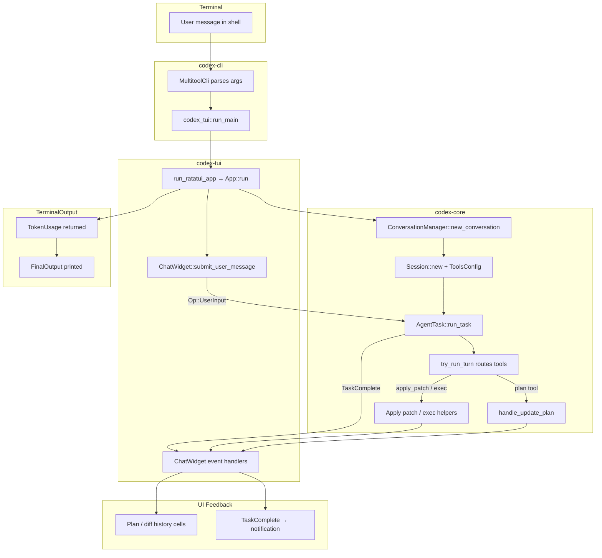

# Terminal Request Flow Through Codex

## High-level sequence
- **CLI bootstrap (`codex-cli`)** parses terminal arguments, launches the interactive TUI, and later prints the final token usage once the session closes.【F:codex-rs/cli/src/main.rs†L166-L209】
- **TUI runtime (`codex-tui`)** normalizes configuration, initializes logging, and drives the `App` loop that renders UI state while relaying protocol events and user input.【F:codex-rs/tui/src/lib.rs†L85-L252】【F:codex-rs/tui/src/app.rs†L36-L157】
- **Conversation management (`codex-tui` + `codex-core`)** spawns a `ConversationManager` backed by `codex-core`, creates a `CodexConversation`, and maintains channel bridges that stream events and accept operations.【F:codex-rs/tui/src/app.rs†L64-L140】【F:codex-rs/tui/src/chatwidget/agent.rs†L13-L61】
- **Session orchestration (`codex-core`)** builds long-lived `Session` state, records history, configures tool availability, and processes each turn through `run_task`/`try_run_turn`, invoking plan, apply-patch, exec, or MCP tools as needed.【F:codex-rs/core/src/codex.rs†L266-L520】【F:codex-rs/core/src/codex.rs†L1600-L2084】【F:codex-rs/core/src/codex.rs†L2440-L2580】
- **UI feedback (`codex-tui`)** renders plan updates, code diffs, tool activity, and final task completion messages based on streamed `EventMsg` variants.【F:codex-rs/tui/src/chatwidget.rs†L329-L406】【F:codex-rs/tui/src/chatwidget.rs†L1035-L1137】【F:codex-rs/tui/src/chatwidget.rs†L224-L320】
- **Final output (`codex-cli`)** receives the aggregated token usage from the TUI and prints a structured `FinalOutput` in the terminal.【F:codex-rs/cli/src/main.rs†L179-L182】

## Detailed flow

### 1. CLI bootstrap (`codex-cli` crate)
The terminal entry point `MultitoolCli` routes interactive invocations to `codex_tui::run_main`, forwarding configuration overrides and awaiting the TUI’s `TokenUsage` result. Upon return it renders the final usage via `codex_core::protocol::FinalOutput`, completing the terminal round-trip.【F:codex-rs/cli/src/main.rs†L166-L209】

### 2. TUI initialization and memory wiring (`codex-tui` crate)
`run_main` consolidates sandbox, approval, and model flags into `ConfigOverrides`, loads project configuration, and initializes tracing before delegating to `run_ratatui_app`. The latter instantiates the terminal, handles onboarding, and finally calls `App::run` with the resolved configuration, initial prompt, and optional resume metadata.【F:codex-rs/tui/src/lib.rs†L85-L420】

Inside `App::run`, a `ConversationManager` (from `codex-core`) is wrapped in an `Arc` and paired with an `AppEvent` channel. The method chooses between fresh and resumed sessions, bootstraps a `ChatWidget`, and enters an event loop that merges UI input with backend protocol events while keeping transcript history and overlays in memory.【F:codex-rs/tui/src/app.rs†L36-L200】

### 3. Conversation lifecycle and memory management (`codex-core` crate)
`ConversationManager` maintains an `Arc<RwLock<HashMap<ConversationId, Arc<CodexConversation>>>>`, creating conversations via `Codex::spawn` and returning the initial `SessionConfigured` event alongside a shared `CodexConversation`. It also exposes helpers to resume, fork, or drop conversations, ensuring session objects stay alive while UI references remain.【F:codex-rs/core/src/conversation_manager.rs†L23-L159】

`Codex::spawn` constructs a `Session` whose mutex-protected `State` tracks approvals, pending input, conversation history, and token accounting. The session also holds a `RolloutRecorder`, MCP and exec managers, and sandbox metadata, guarding them with `Arc`/`Mutex` so concurrent async tasks can mutate safely. During setup it concurrently initializes rollout logging, MCP clients, user shell discovery, and history metadata before emitting the `SessionConfigured` event.【F:codex-rs/core/src/codex.rs†L266-L520】

The `ChatWidget` bridge spawns an async task that listens for `EventMsg`s from `CodexConversation::next_event` and forwards user operations by calling `CodexConversation::submit`. User input is collected as `InputItem`s and delivered as `Op::UserInput`, with optional history persistence via `Op::AddToHistory` to seed future sessions.【F:codex-rs/tui/src/chatwidget/agent.rs†L13-L61】【F:codex-rs/tui/src/chatwidget.rs†L998-L1033】

### 4. Turn processing, planning, and tool invocation (`codex-core` crate)
Each `Op::UserInput` spawns or feeds an `AgentTask`, whose `run_task` loop records the request, streams `TaskStarted`, and repeatedly calls `run_turn` until the model yields an assistant message or tool calls. The turn assembler merges session history, pending user interjections, and tool outputs before handing the prompt to the selected model client.【F:codex-rs/core/src/codex.rs†L1174-L1346】【F:codex-rs/core/src/codex.rs†L1600-L1866】

`Session::new` precomputes a `ToolsConfig` that toggles plan, apply-patch, exec, MCP, unified exec, web search, and image tooling based on model family and sandbox policy. When `try_run_turn` encounters tool requests, it routes them by name: `update_plan` invokes `handle_update_plan` to emit structured plan updates; `apply_patch` and exec calls delegate to sandbox-aware helpers that may stream diffs and approvals; unknown names fall back to MCP dispatch.【F:codex-rs/core/src/codex.rs†L404-L504】【F:codex-rs/core/src/codex.rs†L2440-L2580】【F:codex-rs/core/src/plan_tool.rs†L21-L110】

Throughout a turn the agent stores new `ResponseItem`s, updates rollout logs, and tracks token usage via `TurnDiffTracker`. On successful completion it captures the last assistant message, optionally exits review mode, and emits `TaskComplete`, while errors become `ErrorEvent`s that let the UI recover gracefully.【F:codex-rs/core/src/codex.rs†L1600-L2084】

### 5. UI updates for plan, tools, and code changes (`codex-tui` crate)
`ChatWidget::dispatch_event_msg` matches incoming protocol events to dedicated handlers. Plan updates append rich plan cells to the transcript, exec and MCP events toggle live status blocks, and approval requests are queued to preserve ordering during streaming output.【F:codex-rs/tui/src/chatwidget.rs†L329-L406】【F:codex-rs/tui/src/chatwidget.rs†L1035-L1137】

When the agent proposes workspace edits, `PatchApplyBegin` renders a diff block in the transcript, and `PatchApplyEnd` finalizes it via deferred callbacks—this is the code-field update users see in the UI. Streaming assistant messages, reasoning summaries, and command output share the same history sink, ensuring the code changes appear inline with the conversation context.【F:codex-rs/tui/src/chatwidget.rs†L364-L405】【F:codex-rs/tui/src/chatwidget.rs†L986-L1018】

### 6. Turn completion and terminal output
Upon `TaskComplete`, the chat widget flushes any active streams, marks the task as finished, surfaces a desktop notification, and triggers submission of queued user prompts. When the session ends, `App::run` unwinds, returning aggregate `TokenUsage` to `run_ratatui_app`, which bubbles it back to the CLI. The CLI then prints the final structured output to the terminal, closing the loop from initial command to final message.【F:codex-rs/tui/src/chatwidget.rs†L224-L320】【F:codex-rs/tui/src/app.rs†L142-L157】【F:codex-rs/cli/src/main.rs†L179-L182】

## Mermaid sequence

