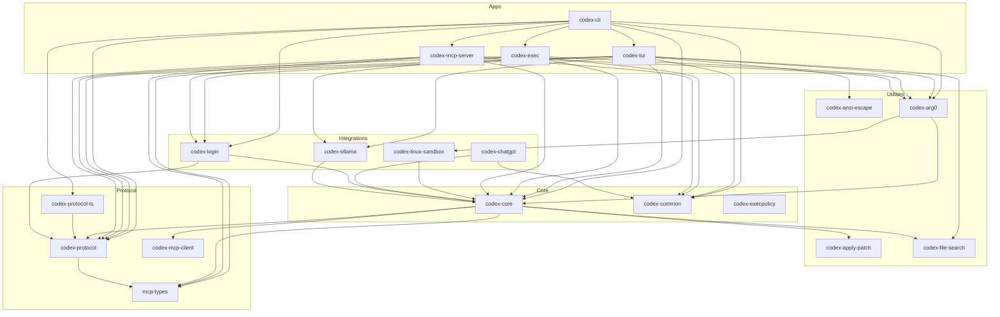

# Codex Rust Workspace — Crate Guide

This folder documents every crate in the `codex-rs` Cargo workspace. It provides a high‑level overview, per‑crate details, and relationships between crates to help you navigate and extend the codebase.

## Workspace Overview

The workspace root is `codex-rs/`. It contains application binaries (CLI frontends) and libraries (business logic, shared types, integrations).

Key entry points:

- `codex-cli` — multipurpose CLI (`codex`) that exposes subcommands (TUI, exec, MCP server, etc.).
- `codex-tui` — full‑screen terminal UI, built with Ratatui.
- `codex-exec` — headless/non‑interactive executor for automation.
- `codex-mcp-server` — run Codex as an MCP server.

## Dependency Map

The diagram shows the major dependencies among workspace crates. Arrows point from a crate to the crate(s) it depends on.

Each crate is documented below and in dedicated per‑crate pages under `crates/`.

## Crates

For deeper details (binaries, features, responsibilities), see the linked pages.

- codex-ansi-escape — helper to turn ANSI text into Ratatui `Text`/`Line`. See `crates/codex-ansi-escape.md`.
- codex-apply-patch — library + `apply_patch` binary to apply patch instructions safely. See `crates/codex-apply-patch.md`.
- codex-arg0 — dispatch helper that re‑execs behavior based on `argv[0]`, integrates with Linux sandbox. See `crates/codex-arg0.md`.
- codex-chatgpt — integration and CLI plumbing to use ChatGPT via Codex. See `crates/codex-chatgpt.md`.
- codex-cli — multi‑tool CLI providing `codex` entrypoint and subcommands. See `crates/codex-cli.md`.
- codex-common — shared CLI/config utilities and helpers. See `crates/codex-common.md`.
- codex-core — core business logic and orchestration for Codex. See `crates/codex-core.md`.
- codex-exec — non‑interactive executor (`codex-exec`) used in automation. See `crates/codex-exec.md`.
- codex-execpolicy — classify proposed exec invocations using a Starlark policy. See `crates/codex-execpolicy.md`.
- codex-file-search — fast fuzzy file search (`codex-file-search`). See `crates/codex-file-search.md`.
- codex-linux-sandbox — Linux sandbox binary and lib integration for Codex. See `crates/codex-linux-sandbox.md`.
- codex-login — login/OAuth flow helpers and CLI wiring. See `crates/codex-login.md`.
- codex-mcp-client — MCP client implementation used by `codex-core`. See `crates/codex-mcp-client.md`.
- codex-mcp-server — launch Codex as an MCP server. See `crates/codex-mcp-server.md`.
- mcp-types — Rust types for the Model Context Protocol. See `crates/mcp-types.md`.
- codex-ollama — Ollama model integration and streaming. See `crates/codex-ollama.md`.
- codex-protocol — internal/external protocol types shared across crates. See `crates/codex-protocol.md`.
- codex-protocol-ts — generate TS definitions for protocol types. See `crates/codex-protocol-ts.md`.
- codex-tui — terminal UI application. See `crates/codex-tui.md`.

## Contributing Tips

- After editing Rust crates, run `just fmt` at `codex-rs/` to format.
- Use `cargo test -p <crate>` to run targeted tests; many TUI tests are snapshot‑based via `insta`.

