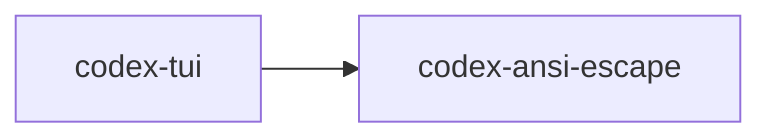

# codex-ansi-escape

Small helper crate that wraps `ansi-to-tui` to convert ANSI‑escaped strings into Ratatui primitives.

## Summary

- Provides safe, simple helpers for the TUI to render colored/escaped output without pulling `ansi_to_tui::IntoText` into broad scope.
- Panics on conversion errors after logging, so callers don’t have to thread `Result` handling through rendering paths.

## Library

- Crate name: `codex-ansi-escape`
- Lib target: `codex_ansi_escape`
- Key functions:
  - `ansi_escape_line(&str) -> ratatui::text::Line<'static>`
  - `ansi_escape(&str) -> ratatui::text::Text<'_>`

## Depends On

- `ansi-to-tui`
- `ratatui`
- `tracing`

## Used By

- `codex-tui`

