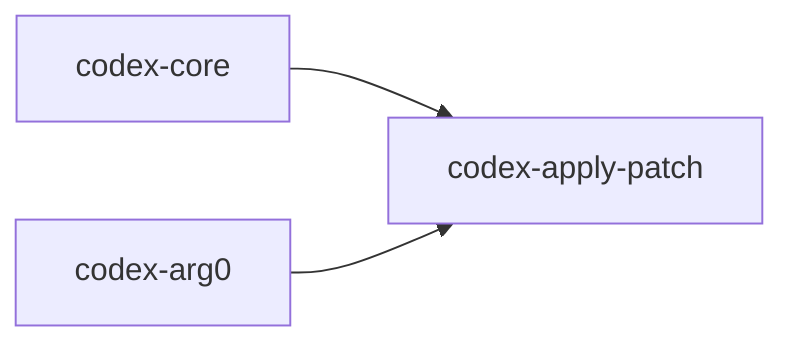

# codex-apply-patch

Library and CLI for applying structured patches to the filesystem.

## Summary

- Parses and applies patch instructions with attention to safety and correctness.
- Used by higher‑level crates to modify files during agent operations.

## Targets

- Lib: `codex_apply_patch`
- Bin: `apply_patch`

## Depends On

- `anyhow`, `thiserror` — error handling
- `similar` — diff utilities
- `tree-sitter`, `tree-sitter-bash` — patch parsing helpers
- `once_cell` — singletons

## Used By

- `codex-core`
- `codex-arg0`

