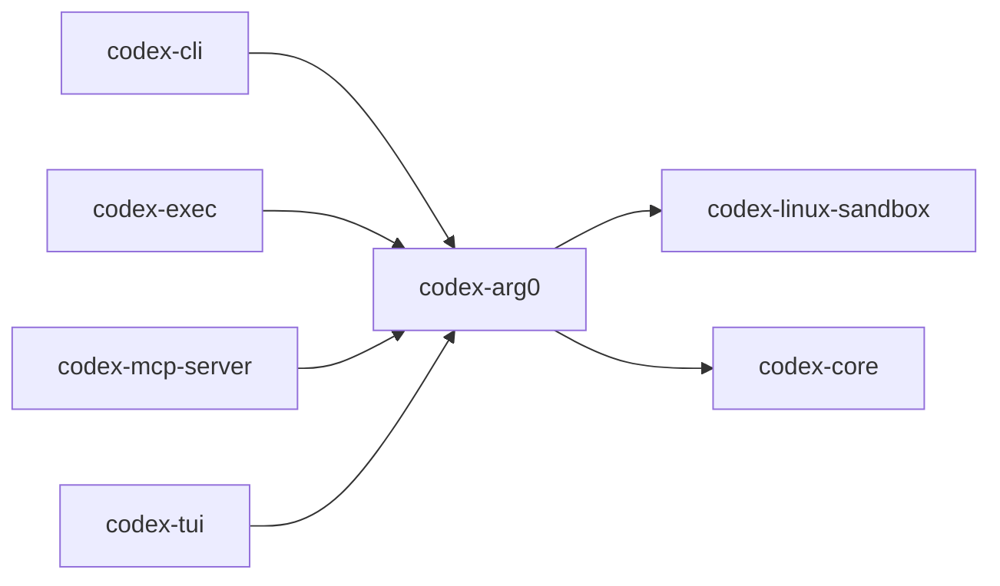

# codex-arg0

Utility crate to inspect `argv[0]` and dispatch behavior accordingly, enabling re‑exec patterns and sandbox integration.

## Summary

- Provides logic shared by multi‑tool CLIs to alter behavior based on the program name used to invoke them.
- Integrates with the Linux sandbox entrypoint so `codex-exec`/`codex` can act as `codex-linux-sandbox` when invoked via that arg0.

## Library

- Lib: `codex_arg0`

## Depends On

- `codex-apply-patch`
- `codex-core`
- `codex-linux-sandbox`
- `tokio`, `anyhow`, `tempfile`, `dotenvy`

## Used By

- `codex-cli`
- `codex-exec`
- `codex-mcp-server`
- `codex-tui`

