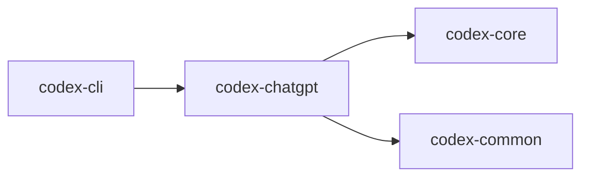

# codex-chatgpt

CLI plumbing and integration to interact with ChatGPT from Codex.

## Summary

- Provides a `clap`-based interface for ChatGPT‑related subcommands.
- Bridges `codex-core` and `codex-common` utilities to configure and run ChatGPT workflows.

## Library

- Lib: n/a (binary‑oriented helper crate)

## Depends On

- `codex-common` (feature: `cli`)
- `codex-core`
- `serde`, `serde_json`, `tokio`, `anyhow`

## Used By

- `codex-cli`

