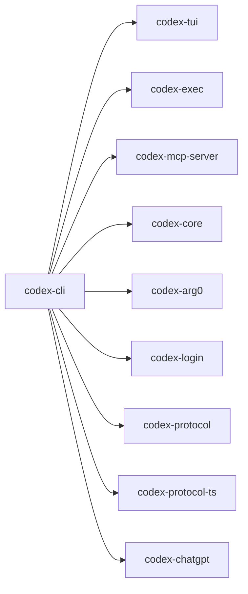

# codex-cli

Multipurpose CLI that provides the `codex` binary with multiple subcommands (TUI, exec, MCP, etc.).

## Summary

- The primary entrypoint for users. Delegates to other crates for actual functionality.
- Wires up logging, config, and command dispatch with `clap`.

## Targets

- Bin: `codex`
- Lib: `codex_cli`

## Depends On (internal)

- `codex-arg0`, `codex-chatgpt`, `codex-common` (cli), `codex-core`, `codex-exec`, `codex-login`, `codex-mcp-server`, `codex-protocol`, `codex-protocol-ts`, `codex-tui`

## Used By

- End users; other crates are wired via subcommands.

