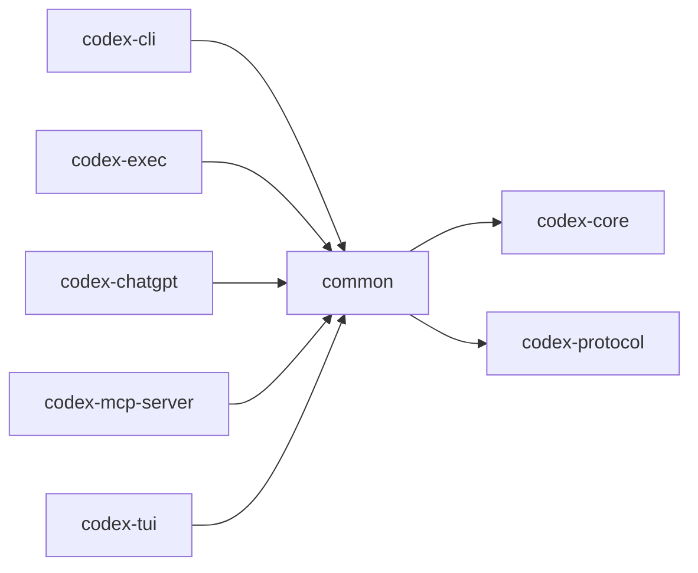

# codex-common

Shared utilities used by CLIs and libraries (config, CLI helpers, elapsed time, sandbox summary, etc.).

## Summary

- Provides optional `cli` feature to include `clap` and serialization helpers without forcing all dependents to pull them in.

## Features

- `cli` — enables `clap`, `serde`, `toml`
- `elapsed` — formatting/reporting helpers for durations
- `sandbox_summary` — helpers to summarize sandbox status

## Depends On

- `codex-core`, `codex-protocol`
- Optional: `clap`, `serde`, `toml`

## Used By

- `codex-cli`, `codex-exec`, `codex-chatgpt`, `codex-mcp-server`, `codex-tui`

