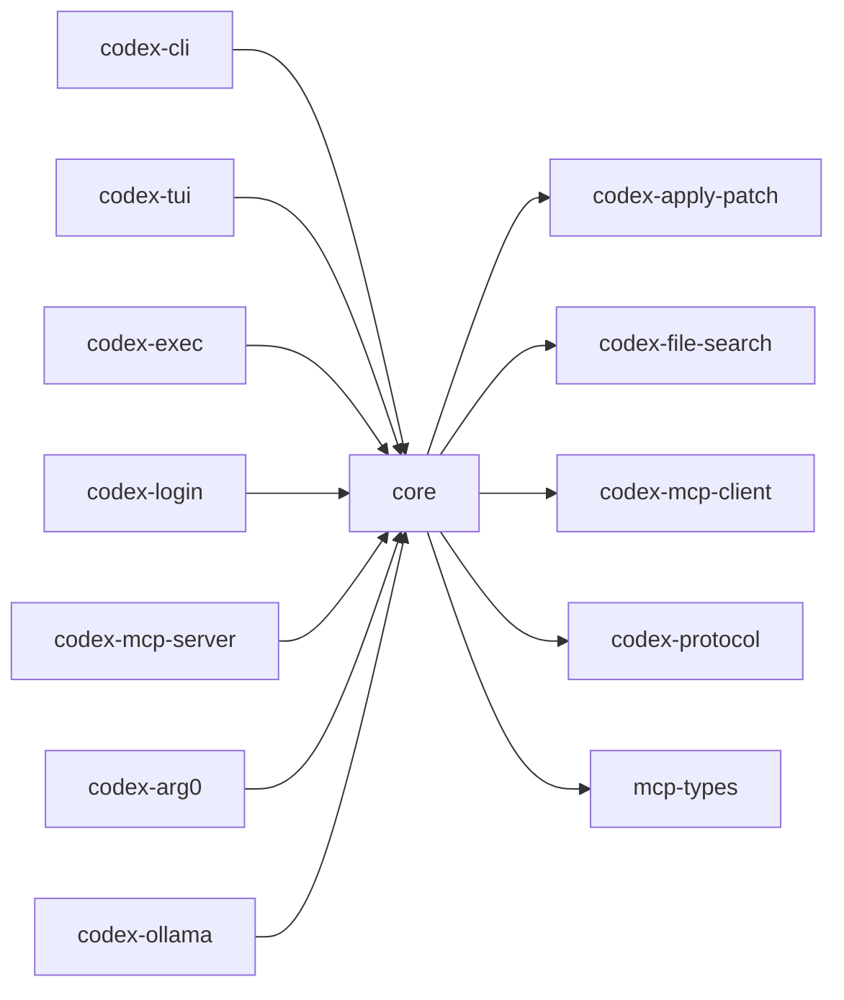

# codex-core

Primary business logic for Codex. Orchestrates sessions, tools, patch application, file search, MCP interactions, and I/O.

## Summary

- Central engine powering both TUI and headless modes.
- Owns interactions with MCP servers/clients, applies patches, manages process execution policies, and coordinates workspace ops.

## Library

- Lib: `codex_core`

## Depends On (internal)

- `codex-apply-patch`, `codex-file-search`, `codex-mcp-client`, `codex-protocol`, `mcp-types`

## Notable External Deps

- `reqwest` (HTTP/streaming), `tokio`, `portable-pty`, `tree-sitter(-bash)`, `uuid`, `futures`, `similar`, `dirs`

## Used By

- `codex-cli`, `codex-tui`, `codex-exec`, `codex-login`, `codex-mcp-server`, `codex-arg0`, `codex-ollama`

