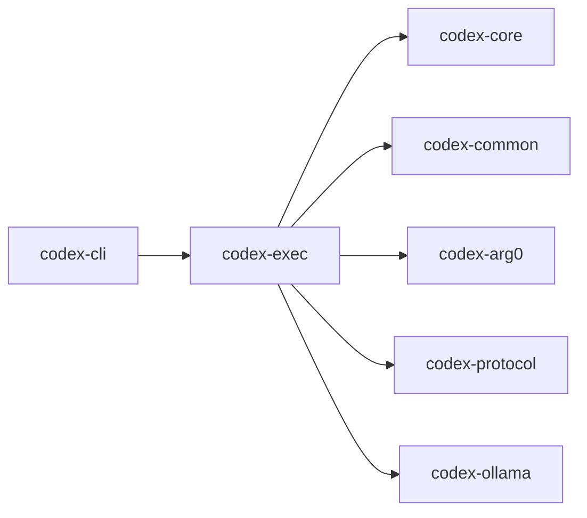

# codex-exec

Headless, non‑interactive executor for Codex workflows. Useful in CI/automation.

## Summary

- Runs Codex to completion from a prompt or stdin, printing results directly.
- Shares core logic with the TUI via `codex-core` and `codex-common`.

## Targets

- Bin: `codex-exec`
- Lib: `codex_exec`

## Depends On (internal)

- `codex-arg0`, `codex-common` (cli, elapsed, sandbox_summary), `codex-core`, `codex-ollama`, `codex-protocol`

## Used By

- Invoked via `codex exec` from `codex-cli` or directly.

