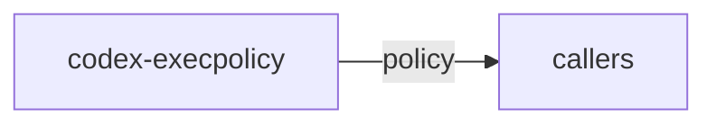

# codex-execpolicy

Classifies proposed `execv(3)` invocations according to a Starlark policy: `safe`, `match`, `forbidden`, or `unverified`.

## Summary

- Ships a default policy (`src/default.policy`).
- CLI can check commands and output structured JSON for callers to decide on safety of writable paths.

## Targets

- Bin: `codex-execpolicy`
- Lib: `codex_execpolicy`

## Depends On

- `starlark`, `serde(_json)`, `regex-lite`, `derive_more`, `allocative`

## Used By

- Referenced by policy discussions and suitable for integration into sandbox pipelines.

