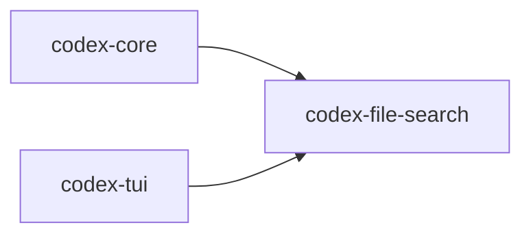

# codex-file-search

Fast fuzzy file search library and CLI used by Codex to quickly locate files in a workspace.

## Summary

- Uses `ignore` (same walker as ripgrep) to enumerate files honoring `.gitignore`.
- Uses `nucleo-matcher` for fast fuzzy scoring.

## Targets

- Bin: `codex-file-search`
- Lib: `codex_file_search`

## Depends On

- `ignore`, `nucleo-matcher`, `serde(_json)`, `clap`, `tokio`, `anyhow`

## Used By

- `codex-core`, `codex-tui`

