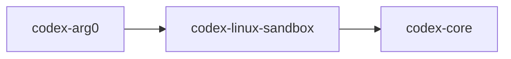

# codex-linux-sandbox

Linux sandbox implementation and CLI used to confine subprocesses (Landlock + seccomp).

## Summary

- Provides a standalone `codex-linux-sandbox` binary and a corresponding `run_main()` entry that can be dispatched to via `codex-arg0`.
- Only compiled with dependencies on Linux; integrates with `codex-core` for policy and config.

## Targets

- Bin: `codex-linux-sandbox`
- Lib: `codex_linux_sandbox`

## Depends On (Linux only)

- `landlock`, `seccompiler`, `libc`, `clap`
- Internal: `codex-core`

## Used By

- `codex-arg0` (dispatch)
- `codex-exec`/`codex-cli` indirectly when sandboxing is enabled

