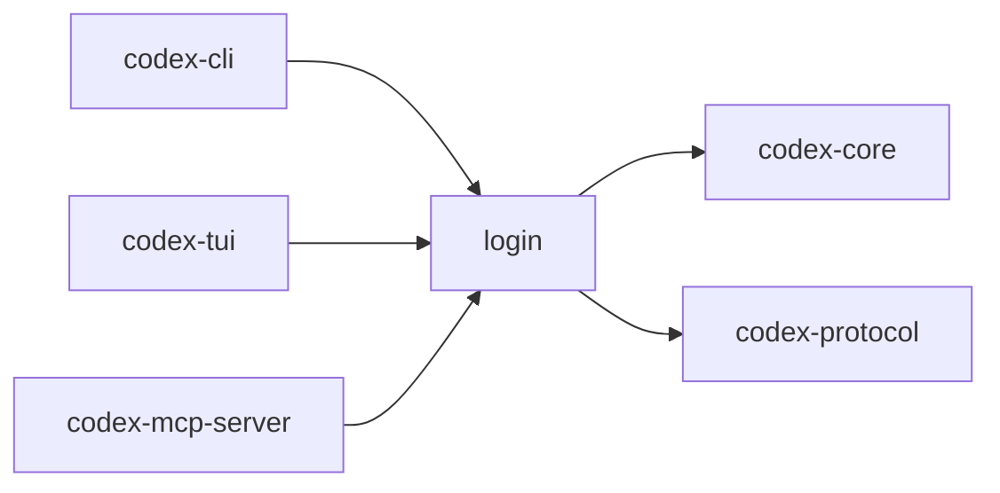

# codex-login

Implements login/OAuth flows and credentials handling for Codex CLIs.

## Summary

- Opens a browser flow and receives callbacks via a local HTTP server.
- Produces tokens/credentials consumable by `codex-core` and other clients.

## Depends On

- `codex-core`, `codex-protocol`
- `reqwest` (blocking/async), `chrono`, `sha2`, `tiny_http`, `webbrowser`, `url(_encoding)`

## Used By

- `codex-cli`, `codex-tui`, `codex-mcp-server`

