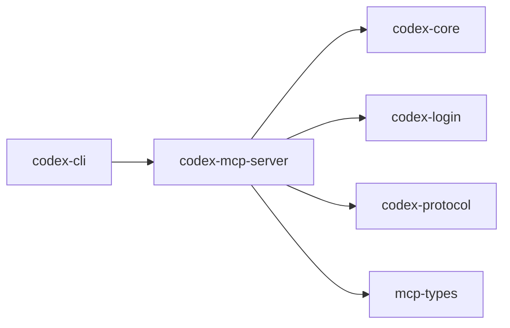

# codex-mcp-server

Runs Codex as an MCP server, exposing its capabilities over the Model Context Protocol.

## Summary

- Bridges `codex-core` to the outside world via MCP. Supports schema generation via `schemars`.
- Ships both a lib and a `codex-mcp-server` binary.

## Targets

- Bin: `codex-mcp-server`
- Lib: `codex_mcp_server`

## Depends On (internal)

- `codex-arg0`, `codex-common` (cli), `codex-core`, `codex-login`, `codex-protocol`, `mcp-types`

## Used By

- `codex-cli` (`codex mcp` subcommand)

