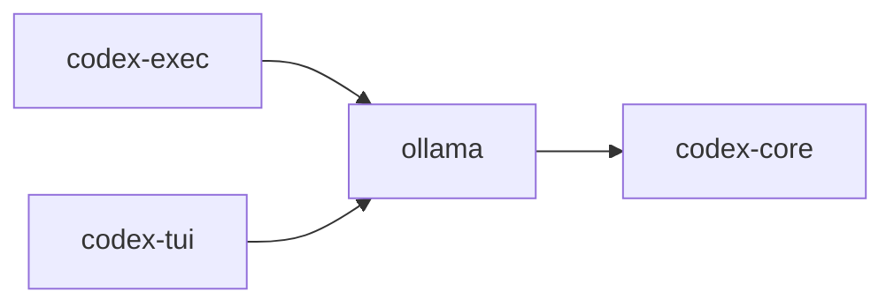

# codex-ollama

Integration with the Ollama model server for local LLM inference and streaming.

## Summary

- Provides async streaming responses and request wiring around `reqwest`.
- Used by TUI and headless executor to interact with local models.

## Library

- Lib: `codex_ollama`

## Depends On

- `codex-core`
- `reqwest`, `tokio`, `futures`, `bytes`, `tracing`, `serde_json`

## Used By

- `codex-exec`, `codex-tui`

