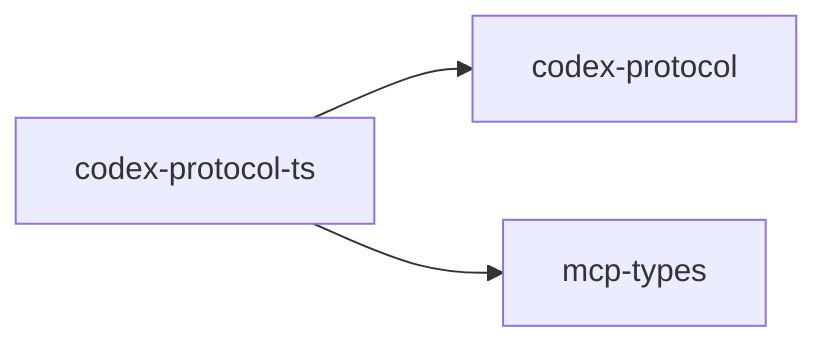

# codex-protocol-ts

Generates TypeScript types from `codex-protocol` using `ts-rs` for downstream tooling.

## Summary

- Ships a `codex-protocol-ts` binary to emit `.d.ts` / TS definitions.

## Targets

- Bin: `codex-protocol-ts`
- Lib: `codex_protocol_ts`

## Depends On

- `codex-protocol`, `mcp-types`, `ts-rs`, `clap`, `anyhow`

## Used By

- `codex-cli` during development workflows and tooling.

