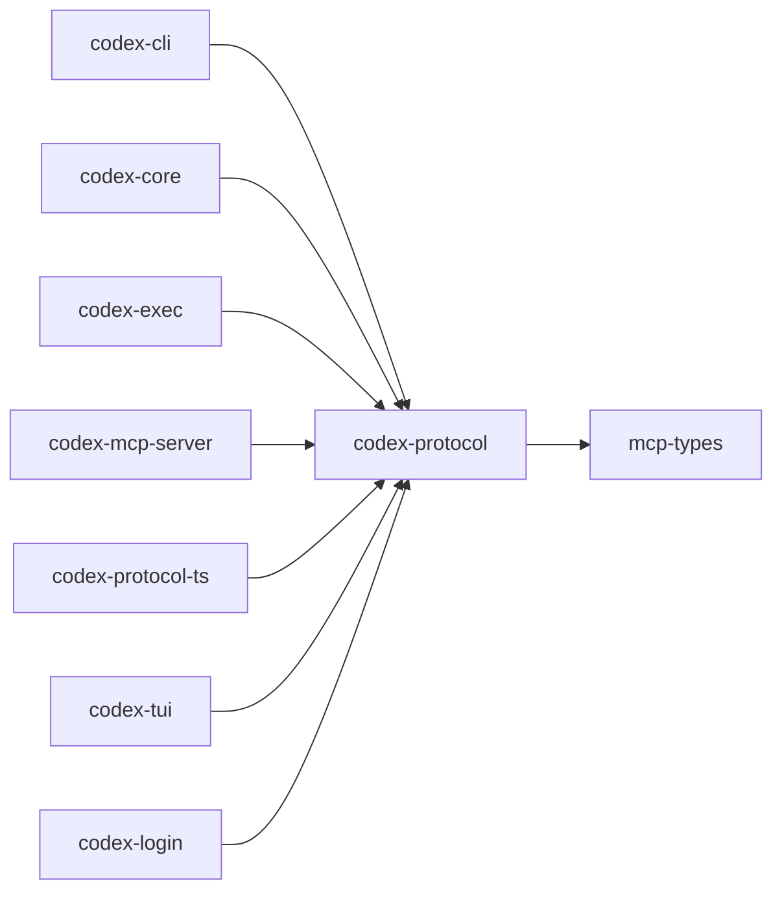

# codex-protocol

Defines internal and external protocol types used throughout Codex and when running as an MCP server.

## Summary

- Houses both UI‑facing and MCP‑facing types with careful dependency hygiene.
- Avoids material business logic; logic is added via extension traits in other crates.

## Library

- Lib: `codex_protocol`

## Depends On

- `mcp-types`, `serde(_json)`, `ts-rs`, `uuid`, `strum(_macros)`, `base64`, `mime_guess`, `sys-locale`

## Used By

- `codex-cli`, `codex-core`, `codex-exec`, `codex-mcp-server`, `codex-protocol-ts`, `codex-tui`, `codex-login`

