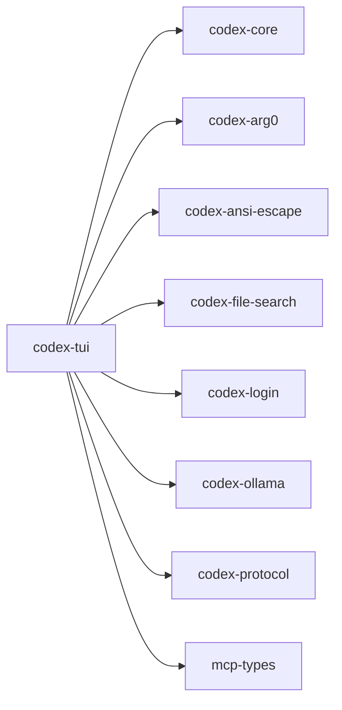

# codex-tui

Full‑screen Text User Interface built with Ratatui. This is the interactive face of Codex.

## Summary

- Provides the terminal UI, keyboard handling, rendering, and session management.
- Integrates sandbox status, MCP resources, file search, and patch previews.
- Heavily tested with `insta` snapshot tests.

## Targets

- Bin: `codex-tui`
- Lib: `codex_tui`

## Depends On (internal)

- `codex-ansi-escape`, `codex-arg0`, `codex-common` (cli, elapsed, sandbox_summary), `codex-core`, `codex-file-search`, `codex-login`, `codex-ollama`, `codex-protocol`, `mcp-types`

## Notable External Deps

- `ratatui`, `crossterm`, `textwrap`, `pulldown-cmark`, `image`, `tracing`

## Tests

- Snapshot tests via `insta`; vt100 emulator support behind `vt100-tests` feature.

