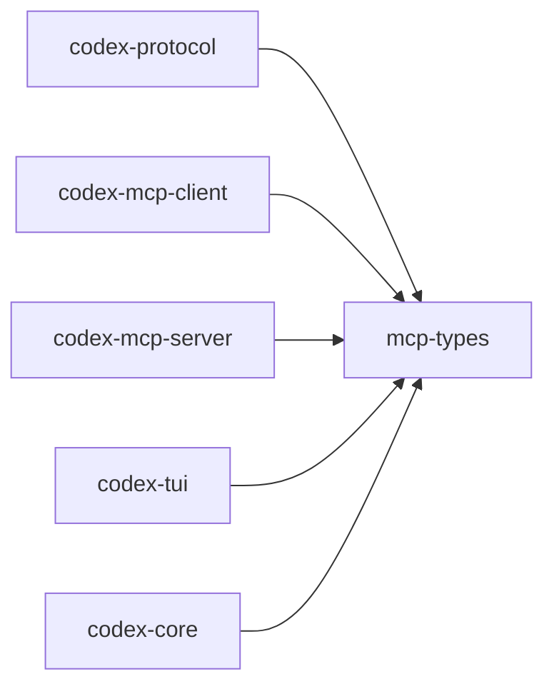

# mcp-types

Rust types for the Model Context Protocol (MCP). Inspired by `lsp-types`.

## Summary

- Source of truth for Rust side of MCP messages and data structures.
- Coordinated with upstream MCP TypeScript/JSON schemas.

## Depends On

- `serde(_json)`
- `ts-rs` (for TypeScript generation in related crates)

## Used By

- `codex-protocol`, `codex-mcp-client`, `codex-mcp-server`, `codex-tui`, `codex-core`

